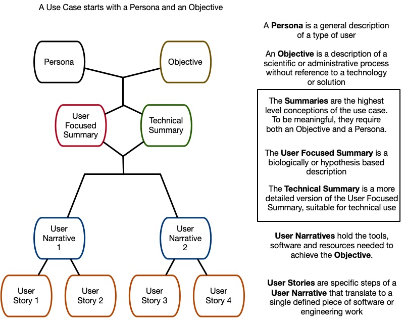

# Use Case Library Glossary

The Use Case Library consists of a set of **user narratives**. Each
narrative captures one set of highly-related scientific objectives and
is achieved by a series of **user epics**. Each epic is enabled by a
set of **user stories**, which are technically-focused details about
how to achieve that epic.  User stories will often be shared among
different epics.

The Use Case Library also provides a set of high level **summaries** that
capture the essential scientific objectives and place them in the context
of larger goals and the Consortium timelines.

### Definitions

**Scientific Objective:** a description of a scientific process, told
without reference to a specific technology solution. Focuses on
resources required, method(s) followed, and outcome(s) targeted. Can
be validated with scientific stakeholders.

#### Persona 
A type of user who will appear in the epics and stories that follow.

#### Scientific Summary
A high-level, non-technical description of an entire Use Case. The user in each summary has a name, a scientific problem, and both proximate and ultimate goals. The focus is on the science and what is generally needed to solve it.

#### Technical Summary
A more technical summary of the Use Case. Like the Scientific Summary, the user has a name, a scientific problem and goals, however here there is more detail about the specific tasks and less focus on the scientific relevance.

#### User Narrative
A story, told from the user's perspective that captures a
valuable set of interactions with tools (e.g. software solutions) in
the service of achieving the scientific objective. Must be written in
terms that are meaningful to the user, preferably from their
perspective. This can be thought of as one in a series of medium scale tasks that must be completed to
answer the question posed in the scientific objective. It should include mentions of everything the user needs to
achieve their goal, even interactions that don't involve the software
or data from the Common Fund. 

#### User Story
A specific piece of a User Narrative that translates to a
well-scoped and defined piece of software or data engineering
work. These should be small tasks that can be verified with engineering teams (Did we deliver it? Yes
or no.) A collection of user stories can be grouped to complete a larger task in a User Narrative. Certain stories are likely to appear in multiple epics and should not be duplicated if possible.

